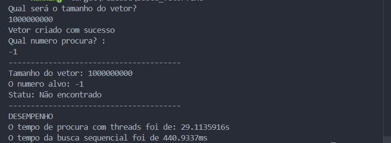
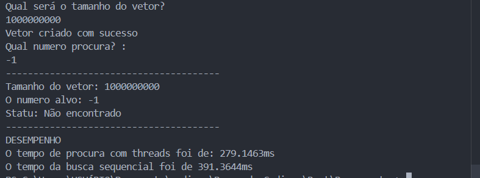

# Busca Concorrente em Vetores Gigantes (Rust)


## Sobre o Projeto
Este projeto foi desenvolvido como requisito acadêmico para explorar padrões de paralelismo, sincronização e comunicação entre processos na disciplina de Sistemas Operacionais / Programação Concorrente na Universidade Federal de Roraima (UFRR). 

O sistema implementa um algoritmo de busca linear concorrente em um vetor de grande escala (1 bilhão de posições) alocado dinamicamente. Durante o desenvolvimento, o projeto evoluiu para um **estudo de caso prático sobre o custo de sincronização (Overhead)**, comparando o desempenho entre travas gerenciadas pelo Sistema Operacional (`Mutex`) e primitivas de hardware (`Atomic Operations`).

## Objetivo e Requisitos
Dividir um vetor em duas partes e usar duas threads para procurar um número.

**Critérios de implementação exigidos:**
* Criar duas threads, cada uma responsável por metade do vetor.
* Usar variável global para indicar se o elemento foi encontrado.
* Proteger o acesso com exclusão mútua (`Mutex`) para evitar condição de corrida.

## Lógica de Concorrência Utilizada

A arquitetura inicial do projeto baseia-se no padrão de **Particionamento de Dados (Data Partitioning)** utilizando as exigências da disciplina:

1. **Compartilhamento Seguro (`Arc`):** O vetor principal e a flag de estado são envelopados em um `Arc` (Atomic Reference Counted). Isso permite que múltiplas threads possuam ponteiros de leitura para a mesma região de memória no Heap, contornando a regra estrita de *Ownership* do Rust sem duplicar dados.
2. **Exclusão Mútua (`Mutex`):** A flag booleana indicando o estado da busca é protegida por um `Mutex`, garantindo que apenas uma thread a modifique por vez e evitando **Condições de Corrida**.
3. **Prevenção de Deadlocks:** O risco foi mitigado garantindo que as threads necessitem de apenas um único recurso bloqueante por vez e que esse *lock* seja liberado imediatamente após a iteração.

---

## Relatório de Desempenho: O Paradoxo do Mutex

Durante os testes de estresse (Benchmarking) com um cenário de pior caso — buscando um alvo inexistente (`-1`) em um vetor de **1.000.000.000 (1 bilhão)** de inteiros —, os resultados revelaram um comportamento contra-intuitivo:

| Algoritmo | Tempo de Execução |
| :--- | :--- |
| **Busca Sequencial (1 Thread)** | `~427 ms` (Milissegundos) |
| **Busca Concorrente (2 Threads + Mutex)** | `~30.7 s` (Segundos) |

> **Comprovação Visual (Teste com Mutex):**
> <br>
> 

**Análise do Gargalo:**
A implementação sequencial demonstrou ser aproximadamente **72 vezes mais rápida** que a versão paralelizada. O gargalo não estava no processamento da memória, mas na estrutura de bloqueio. 

A cada iteração do loop, as threads precisavam verificar o `Mutex`. Para 1 bilhão de posições, isso gerou centenas de milhões de requisições de *lock* e *unlock*. O tempo que o Sistema Operacional gastou gerenciando essa fila de acesso e realizando trocas de contexto (*Context Switches*) destruiu completamente a vantagem do paralelismo.

---

## Evolução Arquitetural: Operações Atômicas

Para mitigar o gargalo de sincronização do `Mutex` e provar a eficiência da concorrência, foi desenvolvida uma segunda versão do algoritmo substituindo o bloqueio de software por primitivas de hardware.

O controle de estado foi refatorado utilizando `std::sync::atomic::AtomicBool`. Diferente do `Mutex`, as variáveis atômicas garantem a segurança da memória e a visibilidade entre threads em um único ciclo de clock da CPU (utilizando `Ordering::Relaxed`), dispensando o gerenciamento do Sistema Operacional e eliminando o *overhead*. Esta versão alcança a velocidade teórica máxima do hardware.

> **Comprovação Visual (Teste com Variáveis Atômicas):**
> <br>
> 

---

## Estrutura do Projeto e Execução

O projeto possui dois executáveis distintos para fins de comparação acadêmica.

Para compilar e executar o projeto com desempenho máximo, certifique-se de usar a flag de otimização `--release`.

**1. Rodar a versão exigida pela disciplina (Com Mutex):**
```bash
cargo run --release
